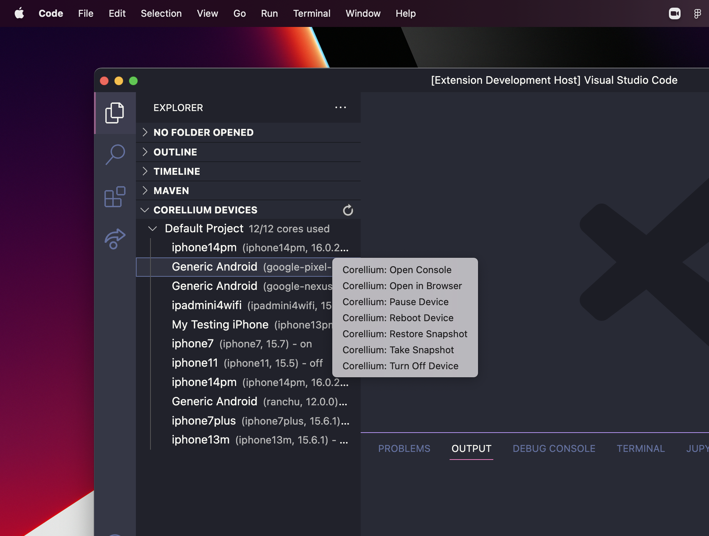

# Corellium VSCode Extension



## Features

- Start a device
- Stop a device
- Reboot a device
- Pause a device
- Resume (unpause) a device
- Open a device in browser
- Open a device console
- Take a snapshot
- Restore a snapshot
- Refresh your list of devices

## Installation

1. Install the extension from the [VSCode Marketplace](https://marketplace.visualstudio.com/items?itemName=corellium.corellium-vscode) or with the terminal command `code --install-extension corellium.corellium-vscode`.
2. Open the extension settings and enter your Corellium API token (and optionally your endpoint).
3. Reload VSCode to apply the changes and start using the extension.


## Development

0. Ensure you have the latest version of [Node.js](https://nodejs.org/en/) and [Yarn](https://yarnpkg.com/) installed.
1. Clone the repo.
2. Run `yarn install` to install dependencies.
3. Run `yarn dev` to compile the extension and watch for changes.
4. Open the `vscode-extension` folder in VSCode.
5. Create `launch.json` file
```json
{
  "version": "0.2.0",
  "configurations": [
    {
      "type": "extensionHost",
      "request": "launch",
      "name": "Launch Extension",
      "runtimeExecutable": "${execPath}",
      "env": {
        "NODE_TLS_REJECT_UNAUTHORIZED": "0"
      },
      "args": [
        "--extensionDevelopmentPath=${workspaceFolder}"
      ],
      "outFiles": ["${workspaceFolder}/out/**/*.js"]
    }
  ]
}
```
5. Launch a new VSCode window with the extension loaded. You can either press `F5` or open the command palette and run `Debug: Start Debugging`.
6. Make changes to the extension and reload the extension to see them take effect.
